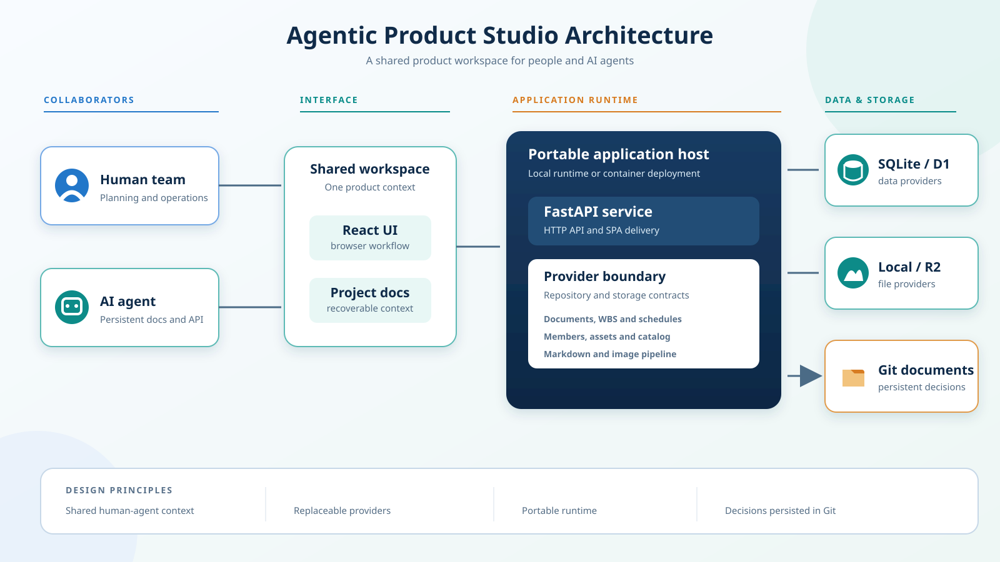

# Agentic Product Studio

개발자·기획자와 AI Agent가 같은 문서와 운영 데이터를 기준으로 제품을 만들어가는 협업 허브입니다.

문서, WBS, 일정, 멤버, 에셋과 카탈로그를 한곳에서 관리하고, AI Agent가 대화 기록에만 의존하지 않고 저장소의 문서와 API를 통해 작업 맥락을 복구하도록 설계했습니다.

> 이 저장소는 포트폴리오 공개판입니다. 실제 서비스의 이름, 도메인, 운영 설정, 비공개 기획, 실데이터와 전용 외부 연동 정보는 전체 Git 이력에서 제거하거나 일반화했습니다.



## 핵심 아이디어

- **사람과 Agent가 공유하는 작업 기준**: 기획 문서와 실행 데이터를 동일한 시스템에서 관리합니다.
- **컨텍스트 손실 대응**: 중요한 결정과 운영 규칙을 저장소 문서로 남겨 새 세션에서도 복구할 수 있습니다.
- **계획과 구현의 연결**: 문서, WBS, 일정, 담당자, 관련 에셋을 서로 연결합니다.
- **에셋 파이프라인**: 업로드, 폴더·태그 분류, 외부 카탈로그 가져오기, 이미지 변환과 중복 방지를 지원합니다.
- **교체 가능한 데이터 계층**: 로컬 SQLite와 Cloudflare D1, 로컬 파일과 R2를 같은 애플리케이션 구조에서 선택할 수 있습니다.

## 주요 기능

- 대시보드: 진행 현황, 마감 작업, 최근 문서, 일정과 공지
- 문서: Markdown 편집·미리보기, 폴더·태그·숨김 처리, WBS 연결, 이미지 자산 삽입
- WBS: 상하위 작업, 담당자, 상태, 우선순위, 진행률과 완료일
- 일정과 멤버: 일정 유형·담당자·연결 작업 및 팀 구성원 관리
- Assets: 파일 업로드, 그룹 트리, 상태·유형·태그, 로컬/R2 저장
- Avatar Catalog: 유형·성별·변형별 카탈로그와 색상 메타데이터
- External Catalog Adapter: 외부 자산 검색, WebP 검증·PNG 변환, 중복 없는 가져오기

## 구조

```text
Browser
  -> React + MUI
      -> FastAPI API
          -> Repository Provider
              -> SQLite (local) / Cloudflare D1
          -> Storage Provider
              -> local files / Cloudflare R2

AI Agent
  -> docs/의 지속 문맥
  -> 동일한 API와 데이터 모델
  -> 구현 결과와 결정 사항을 다시 문서화
```

FastAPI가 API와 React 빌드를 함께 제공하며, Flask 진입점은 기존 CLI와 일부 호환 작업을 위해 남아 있습니다. 자세한 내용은 [아키텍처](docs/architecture.md)를 참고하세요.

## Agent 협업 방식

권장 작업 루프는 다음과 같습니다.

1. `docs/`에서 프로젝트 원칙과 최근 결정을 읽습니다.
2. 관련 문서·WBS·에셋을 API 또는 로컬 데이터로 확인합니다.
3. 사람에게 확인이 필요한 선택지를 분리합니다.
4. 구현과 검증을 수행합니다.
5. 변경 이유와 다음 작업을 다시 문서에 기록합니다.

세부 원칙은 [Agent 협업 가이드](docs/agent-collaboration.md)에 정리되어 있습니다.

## 기술 스택

- Frontend: React, React Router, MUI, Vite
- Backend: FastAPI, Uvicorn, Flask 호환 CLI
- Data: SQLite 또는 Cloudflare D1
- Storage: local filesystem 또는 Cloudflare R2
- Packaging: Docker
- Test: Python `unittest`, frontend production build

## 빠른 시작

### 1. 환경 준비

```bash
python -m venv .venv
pip install -r requirements.txt
npm run frontend:install
```

`.env.example`을 `.env`로 복사합니다. 공개판 기본값은 SQLite와 로컬 파일 저장소를 사용하므로 Cloudflare 계정 없이 실행할 수 있습니다.

### 2. 샘플 데이터와 실행

```bash
flask --app run.py init-db
flask --app run.py seed-sample-data
flask --app run.py import-avatar-assets
npm run frontend:build
uvicorn asgi:app --reload
```

브라우저에서 `http://127.0.0.1:8000`을 엽니다.

PowerShell에서는 아래 래퍼를 사용할 수도 있습니다.

```powershell
.\scripts\run_local.ps1
```

## 외부 카탈로그 연동

공개판은 특정 서비스에 종속된 주소나 데이터 계약을 포함하지 않습니다. 기본 URL은 `catalog.example.com` 예시이며, 실제 사용 시 허가받은 API에 맞춰 어댑터와 환경 변수를 구성해야 합니다.

- `EXTERNAL_CATALOG_SEARCH_URL`
- `EXTERNAL_CATALOG_THUMBNAIL_URL_TEMPLATE`

응답 정규화, 이미지 검증, PNG 변환, 중복 방지 흐름은 유지되어 있어 별도 카탈로그에 연결할 수 있습니다. 자세한 계약은 [에셋 관리](docs/asset-management.md)를 참고하세요.

## 선택적 Cloudflare 구성

Cloudflare D1/R2를 사용하려면 `.env.example`의 관련 값을 별도 Secret으로 주입합니다. 저장소에는 실제 계정 ID, 데이터베이스 ID, 토큰, 액세스 키를 커밋하지 않습니다.

예시 설정 파일:

- `wrangler.toml.example`
- `worker-python/wrangler.toml.example`
- `database/d1/schema.sql`
- `database/d1/migrations/`

## 검증

```bash
python -m unittest discover -s tests -v
npm run frontend:build
```

## 저장소 구성

```text
app/                  Flask 호환 계층, 저장소·스토리지 구현, 공용 도메인 로직
fastapi_app/          FastAPI 앱과 API router
frontend/             React + MUI 클라이언트
database/d1/          D1 기준 스키마와 마이그레이션
database/seeds/       공개용 소형 샘플 데이터
docs/                 Agent가 복구 가능한 설계·운영 문맥
tests/                백엔드와 보안 헤더 검증
worker/               JavaScript Worker 실험 구현
worker-python/        Python Worker 실험 구현
```

## Git 이력에 대하여

이 공개판은 실제 제품 개발 저장소의 커밋 흐름을 복제한 뒤 공개 가능한 형태로 재작성했습니다. 작성자, 날짜, 순서와 개발 단계는 보존했지만 파일 내용이 바뀌었으므로 커밋 해시는 원본과 다릅니다. 비공개 정보만 다루던 일부 커밋은 흐름 보존을 위해 빈 커밋으로 남을 수 있습니다.

정제 원칙과 공개 범위는 [이력 정제 기록](docs/history-sanitization.md)에 설명되어 있습니다.
